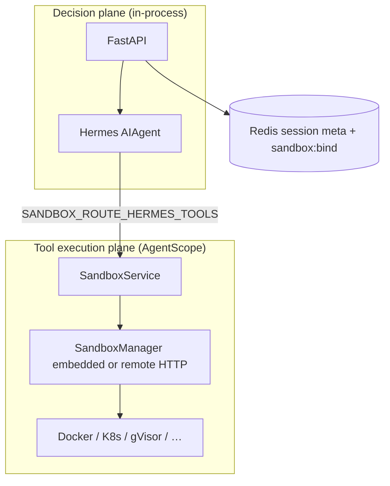

# Agent Runtime

OpenAI 兼容网关：**宿主机（控制面进程）内嵌单一 Hermes `AIAgent`**。有两条执行路径可以并存：

- **A — Hermes 自带后端**：`hermes config set terminal.backend docker` 等，由 Hermes 读 `~/.hermes` 决定终端/部分工具落点（见 [Docker backend](https://hermes-agent.nousresearch.com/docs/user-guide/docker)）。
- **B — AgentScope 沙箱（推荐与会话对齐）**：启用 **`SandboxManager`**（嵌入式池或 **`SANDBOX_MANAGER_BASE_URL`**）后，网关可为每个 **`session_id`** **自动 acquire/release** 一个容器，并把 Hermes 的 **`terminal`** / **`code_execution`** 工具集换成 **`sandbox_shell`** / **`sandbox_python`**，经 **`SandboxManager.call_tool`** 走进同一沙箱（见下文「会话绑定与 Hermes 工具路由」）。

## 架构（决策层 / 执行层分离 — 最小落地）



对照工程图：**Hermes** 承担 Agent 决策；**SandboxService + SandboxManager** 承担沙箱申请/释放与池化（嵌入式或指向独立 **Sandbox Manager** 服务）。

```
POST /v1/chat/completions  （OpenAI 形状，带 session_id）
       │
       ▼
┌────────────────────────────────────────────────────────────┐
│  FastAPI 控制面（单进程，uvicorn）                          │
│  Dispatcher → SessionRouter（Redis：会话元数据）             │
│  → HermesRuntimeBridge.run_conversation（run_agent.AIAgent）│
└────────────────────────────────────────────────────────────┘
       │  B：`sandbox_shell` / `sandbox_python`；A：`terminal` / `execute_code`（若未禁用）
       ▼
┌────────────────────────────────────────────────────────────┐
│  A：Hermes ~/.hermes terminal.backend 等（可选）              │
│  B：会话绑定容器 + sandbox_shell / sandbox_python → SM       │
└────────────────────────────────────────────────────────────┘
```

- **会话隔离**：`session_id` → `conversation_history` + `task_id`（进程内字典；销毁会话可 `DELETE /sessions/{id}`）。
- **[AgentScope Runtime](https://github.com/agentscope-ai/agentscope-runtime)**（可选）：`SandboxManager` 负责 **池化与生命周期**。启动优先级：**`SANDBOX_MANAGER_BASE_URL`**（远程 HTTP 客户端）**优于** **`AGENTSCOPE_SANDBOX_POOL_SIZE`**（进程内嵌入式池）。HTTP API：**`POST /sandbox/v1/acquire`**、**`POST /sandbox/v1/run-python`**、**`POST /sandbox/v1/run-shell`**、**`POST /sandbox/v1/release`**、**`GET /sandbox/v1/status`**。

### 会话绑定与 Hermes 工具路由（B 线）

| 变量 | 默认 | 作用 |
|------|------|------|
| `SANDBOX_BIND_SESSION` | `1` | 每条聊天在进入 Hermes 前 **`ensure_session_sandbox`**：无绑定则 `SandboxService.acquire`，Redis 键 **`sandbox:bind:{session_id}`** → `container_name`，TTL 与 `SESSION_TIMEOUT` 一致；`DELETE /sessions/{id}` 时 **`release`** 并删键。 |
| `SANDBOX_ROUTE_HERMES_TOOLS` | `1` | 在 **SandboxManager 可用** 时，禁用 Hermes 内置 **`terminal`**、**`code_execution`**，注册 **`sandbox_shell`** / **`sandbox_python`**（工具集名默认 **`gateway_sandbox`**，可用 **`SANDBOX_GATEWAY_TOOLSET`** 改）。模型需调用这两个名字，而不是 `terminal` / `execute_code`。 |
| `HERMES_ENABLED_TOOLSETS` | 未设 | 若使用 **白名单**，必须把 **`gateway_sandbox`**（或你自定义的 **`SANDBOX_GATEWAY_TOOLSET`**）列入，否则网关工具不会出现在模型侧。 |

若将 **`SANDBOX_ROUTE_HERMES_TOOLS=0`** 或未启用 SandboxManager，则仍可按 A 线仅依赖 Hermes 的 `terminal.backend` 等配置。

## 验证（幂等）

```bash
bash scripts/verify_host_hermes.sh
# Uses Redis on host port 16379 by default (avoids conflict with local :6379).
# VERIFY_REDIS_HOST_PORT=26379 bash scripts/verify_host_hermes.sh   # if 16379 is busy
# Uses ./.venv or creates it — avoids Ubuntu/Debian PEP 668 (externally-managed-environment).
# If venv has no pip: script bootstraps via ensurepip or get-pip.py; or run:
#   sudo apt install python3-pip python3-venv python3-full
```

密钥：**不必**再设 `OPENROUTER_API_KEY`。若本机已用 `hermes model` 配好 **`~/.hermes`**，`AIAgent` 会像 CLI 一样读 **`~/.hermes/.env`** 与 **`config.yaml`**（代码里只有设置了环境变量才会覆盖）。脚本在检测到 `~/.hermes/.env` 或相关 env 时会自动跑一轮 chat。

脚本会：**删除**带 `managed-by=agent-runtime` 的旧沙箱容器、**重建** `agent-runtime-redis`、`pip install`、临时启动 `:8080` 并 `curl /health`。

### 沙箱执行面（可选）

需本机 **Docker**（首次会拉 AgentScope 沙箱镜像）。二选一：

**A — 与 Hermes 验证脚本同一终端会话**：先跑完 `verify_host_hermes.sh` 后进程会退出；另开终端启动带池的控制面：

```bash
cd /path/to/agent-runtime
source .venv/bin/activate
export REDIS_URL=redis://127.0.0.1:16379/0
export AGENTSCOPE_SANDBOX_POOL_SIZE=1
export CONTAINER_DEPLOYMENT=docker
python -m uvicorn app.main:app --host 127.0.0.1 --port 8080
```

等待十几秒让 watcher 预热池，再：

```bash
curl -s http://127.0.0.1:8080/sandbox/v1/status | python3 -m json.tool
curl -s -X POST http://127.0.0.1:8080/sandbox/v1/acquire \
  -H "Content-Type: application/json" \
  -d '{"session_ctx_id":"test-1","sandbox_type":"base"}' | python3 -m json.tool
# 用上一步返回的 container_name：
curl -s -X POST http://127.0.0.1:8080/sandbox/v1/run-python \
  -H "Content-Type: application/json" \
  -d '{"container_name":"<paste_here>","code":"print(1+1)"}' | python3 -m json.tool
curl -s -X POST http://127.0.0.1:8080/sandbox/v1/release \
  -H "Content-Type: application/json" \
  -d '{"container_name":"<paste_here>"}' | python3 -m json.tool
```

**B — 一键冒烟**（未起服务时会临时起 Redis + uvicorn）：`bash scripts/verify_sandbox_plane.sh`

远程 Manager 时改设 **`SANDBOX_MANAGER_BASE_URL`**，无需 **`AGENTSCOPE_SANDBOX_POOL_SIZE`**。

## 清理（手动；破坏性）

此前若跑过验证脚本遗留容器、或跑过 Kind：

```bash
docker rm -f agent-runtime-redis
docker ps -aq --filter label=managed-by=agent-runtime | xargs -r docker rm -f   # Linux
kind delete cluster --name hermes-runtime
```

## Kind / K8s

```bash
bash scripts/setup_kind.sh
# k8s/secret.yaml：默认只有开关项；密钥请放在挂载的 ~/.hermes 或按需增加 Secret 键
bash scripts/deploy.sh
bash scripts/test.sh
```

控制面镜像 **`Dockerfile`** 内含 `hermes-agent` 与 `agentscope-runtime`。若启用 AgentScope 池且后端为 Docker，镜像内需可用 Docker 守护进程（常见做法：挂载 **`/var/run/docker.sock`**，仅建议测试环境）。走 **A 线** 且 Hermes **`terminal.backend docker`** 时，宿主同样需要 Docker；**B 线** 仅依赖 SandboxManager 能否调度容器。

## AgentScope 沙箱池（可选）

依赖 [agentscope-runtime](https://github.com/agentscope-ai/agentscope-runtime) 的 **`SandboxManager`**。环境变量见 `.env.example`。

- **`SANDBOX_MANAGER_BASE_URL`**：若设置，本进程仅作为 **远程 Manager 的 HTTP 客户端**（适合与公司「远程沙箱服务」对齐）；不设则看嵌入式池配置。
- **`SANDBOX_MANAGER_TOKEN`**：可选 `Bearer` token。
- **`AGENTSCOPE_SANDBOX_POOL_SIZE`**：未配置远程 URL 时，`>0` 启用 **嵌入式** 管理器 + watcher + warm 池。
- **`CONTAINER_DEPLOYMENT`**：传给上游配置，如 `docker` / `gvisor` / `k8s` 等（详见 AgentScope 文档）。
- **`AGENTSCOPE_SANDBOX_WATCHER_INTERVAL`**：后台扫描间隔（秒），默认 `15`。
- **`AGENTSCOPE_SANDBOX_MOUNT_DIR`**：本地会话挂载目录，默认 `sessions_mount_dir`。

`core/sandbox_service/service.py` 中的 **`SandboxService`** 封装 `create_from_pool_async` / `release_async`。`demo_tools/` 仍可用 **`BaseSandbox`** 做一次性演示。

## 目录结构（节选）

```
├── app/                      # FastAPI
├── core/session/             # SessionRouter
├── core/sandbox_service/     # SandboxService facade
├── infra/agentscope_sandbox_service.py  # SandboxManager bootstrap (remote | embedded)
├── runtime/agent/            # HermesRuntimeBridge
├── demo_tools/               # examples (BaseSandbox)
├── scripts/verify_host_hermes.sh
├── scripts/verify_sandbox_plane.sh
└── Dockerfile                # 控制面镜像（Hermes + AgentScope Runtime）
```

## API

请求体里的 **`model`**：默认占位符 **`hermes`** 表示「交给 Hermes 按 `~/.hermes` 解析」。若嵌入库未正确读出你在 YAML 里配的型号（个别提供商会出现空 model），请在 JSON 里写上 **`config.yaml` 里同一套模型 id**，或设置环境变量 **`HERMES_MODEL`**。

| 端点 | 方法 | 说明 |
|------|------|------|
| `/v1/chat/completions` | POST | OpenAI 兼容聊天 |
| `/health` | GET | 健康检查 |
| `/status` | GET | 运行模式说明 |
| `/sessions/{id}` | DELETE | 丢弃进程内历史并删 Redis 会话键 |
| `/sandbox/v1/status` | GET | 沙箱执行面是否可用 |
| `/sandbox/v1/acquire` | POST | 申请沙箱（body: `session_ctx_id`, 可选 `sandbox_type` / `meta`） |
| `/sandbox/v1/run-python` | POST | 沙箱内执行 Python（body: `container_name`, `code`） |
| `/sandbox/v1/run-shell` | POST | 沙箱内执行 shell（body: `container_name`, `command`） |
| `/sandbox/v1/release` | POST | 释放沙箱（body: `container_name`） |

## Hermes 配置提示

- **不要用顶层包名 `tools/`**：会与 **`hermes-agent` 自带的 `tools` 包**冲突（`ModuleNotFoundError: tools.registry`）。旧的示例已改名为 **`demo_tools/`**。
- **模型与密钥**：与 CLI 相同，优先 **`~/.hermes/.env`** + **`config.yaml`**。本项目的 `OPENROUTER_API_KEY` 等**仅作可选覆盖**（适合 K8s Secret、CI）；宿主已配好 Hermes 时**不用**在 `.env` 里重复写。
- **终端沙箱（A 线）**：在宿主执行例如 `hermes config set terminal.backend docker`，详见 [Docker backend](https://hermes-agent.nousresearch.com/docs/user-guide/configuration#docker-backend)。启用 B 线时以 **`sandbox_shell`** 为主，无需依赖 Hermes Docker terminal 与网关沙箱一致。
